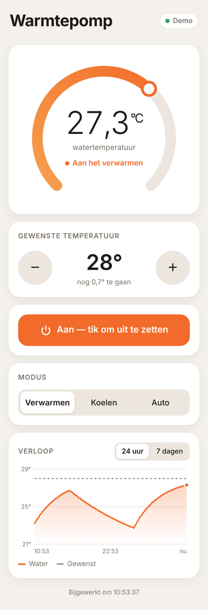
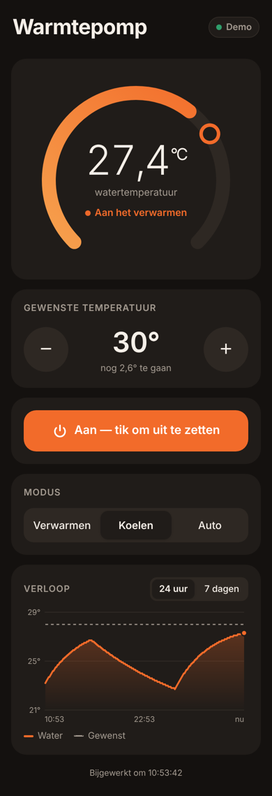

# smartheatpump-connection

Lees en stuur je warmtepomp aan die je nu met de **Smart Heatpump**-app (Tuya) bedient,
zonder de app: via je eigen netwerk (lokaal) of via de Tuya-cloud.

<p>
  
  
</p>

## Installeren

```bash
pip install -e .
```

## 1. Gegevens van je warmtepomp ophalen (eenmalig)

Je hebt een **device ID** en een **local key** nodig. Die haal je zo op:

1. Maak een gratis account aan op <https://iot.tuya.com> en maak een *Cloud Project* aan
   (datacenter: **Central Europe**).
2. Ga in het project naar *Devices → Link App Account* en scan de QR-code met de
   Smart Heatpump-app (of Smart Life / Tuya Smart). Je warmtepomp verschijnt in de lijst.
3. Voer de wizard uit en vul de API key/secret van je project in:
   ```bash
   python -m tinytuya wizard
   ```
   Daarna staan `id`, `key` (= local key) en het IP-adres in `devices.json`.

Zoek eventueel het IP-adres op je netwerk met `smartheatpump scan`.

## 2. Configureren

```bash
cp config.example.json config.json   # en vul in
```

Voor **lokaal** zijn `device_id`, `ip` en `local_key` genoeg.
Voor **cloud** (werkt overal, ook buitenshuis) vul je `device_id`, `api_key`, `api_secret` in.
Alles kan ook via omgevingsvariabelen: `SHP_DEVICE_ID`, `SHP_IP`, `SHP_LOCAL_KEY`,
`SHP_API_KEY`, `SHP_API_SECRET`, `SHP_API_REGION`. `config.json` wordt niet in git opgenomen.

## 3. Gebruiken

```bash
smartheatpump status          # aan/uit, watertemperatuur, doeltemperatuur, modus
smartheatpump on | off
smartheatpump set-temp 28
smartheatpump set-mode heat   # waarde verschilt per model
smartheatpump log --interval 60 --file warmtepomp.csv
smartheatpump dps             # alle ruwe datapoints
smartheatpump --via cloud status
```

Of vanuit Python:

```python
from smartheatpump import HeatPump, load_config

pump = HeatPump(load_config())
print(pump.status().as_dict())
pump.set_target_temp(28)
```

## iPhone-app

Een web-app die je op je beginscherm zet en die werkt als een gewone app: wijzerplaat met de
watertemperatuur, gewenste temperatuur met +/−, aan/uit, modus en een grafiek van de afgelopen
24 uur of 7 dagen. Volgt automatisch de lichte/donkere modus van je iPhone.

### Eerst bekijken met nepgegevens

```bash
SHP_DEMO=1 smartheatpump serve
```

Open daarna `http://<ip-van-je-computer>:8000` op je iPhone (zelfde wifi).

### Echt gebruiken

1. Zorg dat `smartheatpump status` werkt (zie hierboven).
2. Start de server op een computer die altijd aan staat, bijvoorbeeld een Raspberry Pi:
   ```bash
   smartheatpump serve
   ```
   Of met Docker:
   ```bash
   docker build -t smartheatpump .
   docker run -d --restart unless-stopped --network host -v $PWD:/data smartheatpump
   ```
   (`--network host` is nodig voor de lokale verbinding met de warmtepomp; `config.json` staat in de huidige map.)
3. Open `http://<ip-van-de-server>:8000` in **Safari** op je iPhone.
4. Tik op **Deel** (vierkantje met pijl) → **Zet op beginscherm**.

De server meet elke 5 minuten de temperatuur voor de grafiek (`history.db`, 30 dagen bewaard).

### Buitenshuis gebruiken

Zet de server **niet** zomaar open op internet. De makkelijkste veilige manier is
[Tailscale](https://tailscale.com) (gratis): installeer het op de server en op je iPhone, en open
de app via het Tailscale-adres van de server.

Stel daarnaast altijd een wachtwoord in als de app buiten je eigen netwerk bereikbaar is:
`"app_password": "..."` in `config.json` of `SHP_APP_PASSWORD`. De app vraagt er eenmalig om.

### Instellingen voor de app

In `config.json`:

- `temp_min` / `temp_max`: bereik van de gewenste temperatuur (standaard 5–40 °C)
- `modes`: de modi van jouw warmtepomp, bijvoorbeeld
  `[{"value": "heat", "label": "Verwarmen"}, {"value": "eco", "label": "Eco"}]`.
  De `value` moet overeenkomen met wat `smartheatpump dps` laat zien.

## Datapoints aanpassen

Elk warmtepompmodel gebruikt eigen datapoint-nummers (DP's). De standaard is
`power=1, target_temp=2, current_temp=3, mode=4, fault=15`. Klopt de status niet?

1. Run `smartheatpump dps`, verander iets in de app en run het opnieuw. Kijk welk nummer
   meeverandert.
2. Pas `dp_map` in `config.json` aan.
3. Geeft je pomp temperaturen ×10 terug (bijv. `285` voor 28,5 °C)? Zet dan `"temp_scale": 10`.

Via de cloud heten de DP's codes (bijv. `"switch"`, `"temp_set"`). Gebruik die namen dan in `dp_map`.

## Tests

```bash
pip install pytest && pytest
```
